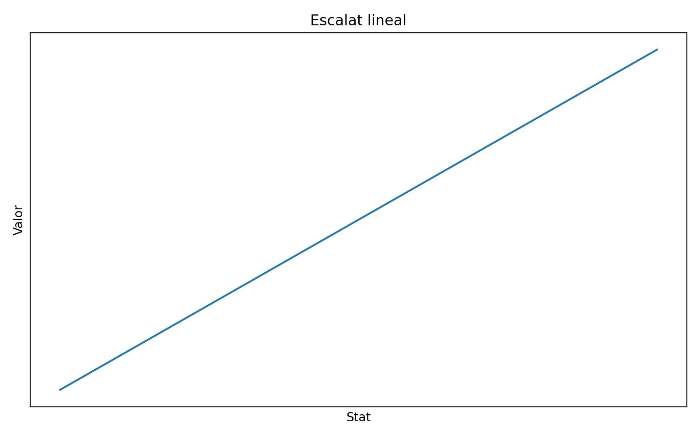
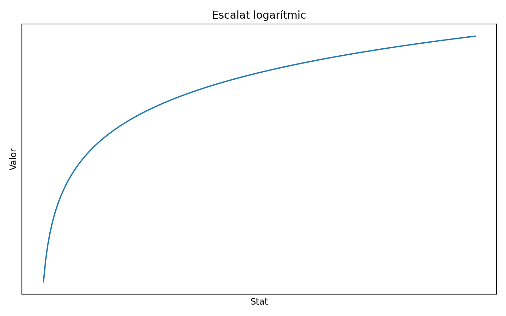
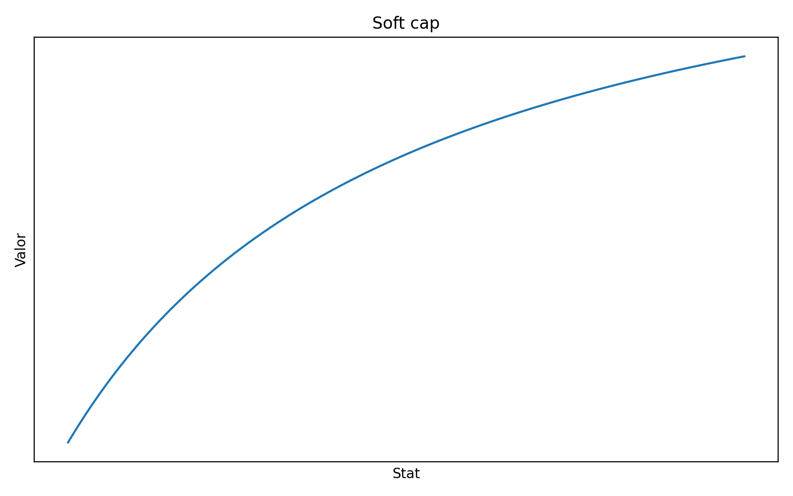
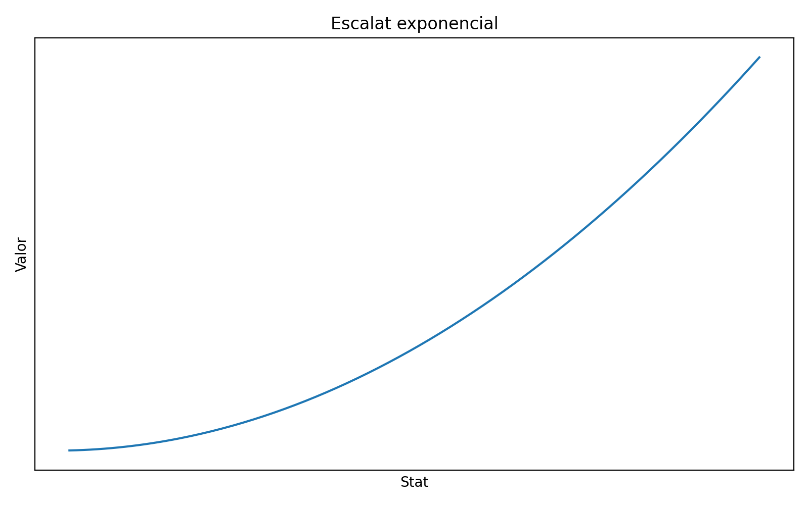
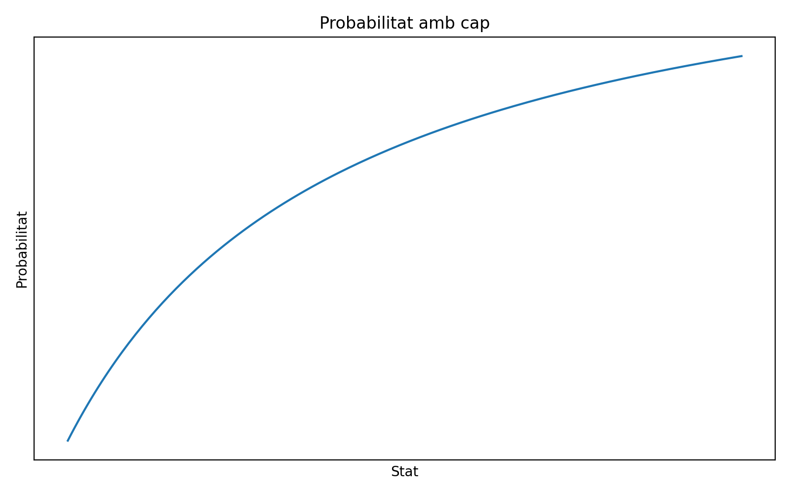
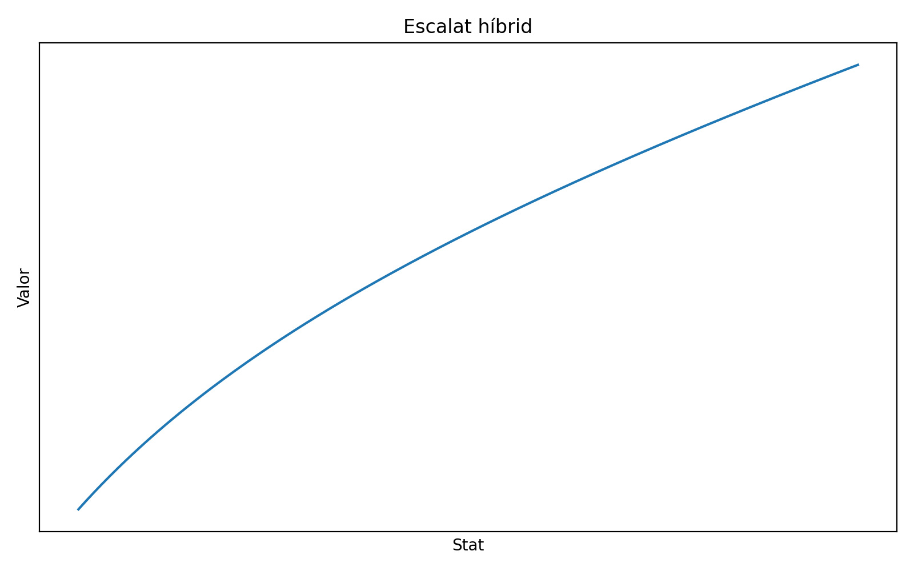

# ▌Corbes i Scaling

[← Tornar a l'índex](../INDEX.md)

---

## Introducció

El sistema de combat no es basa únicament en valors lineals.  
Per garantir un **balance estable**, evitar **power creep** i permetre una major flexibilitat en la construcció de personatges, s’introdueixen corbes d’escalat.

Aquestes corbes defineixen com les estadístiques afecten els resultats reals en combat.

---

## ▌Per què són necessàries?

Sense corbes d’escalat:

- Les builds extremes dominen el meta
- Algunes estadístiques es tornen inútils
- Es poden generar personatges desequilibrats
- El sistema es trenca en fases avançades

Amb corbes:

- Es controlen els valors màxims
- Es fomenta la diversificació d’estadístiques
- Es manté l’equilibri global

---

## ▌Tipus de corbes

### ▌Escalat lineal

Creixement constant per cada punt invertit.

```text
valor = base + a · stat
````

<p align="center">
  
  <br>
  <em>Escalat lineal</em>
</p>

✔ Simple
✔ Previsible
❌ Difícil de balancejar a llarg termini

---

### ▌Escalat logarítmic

Cada punt addicional té menys impacte que l’anterior.

```text
valor = base + a · log(stat)
```

<p align="center">
  
  <br>
  <em>Escalat logarítmic</em>
</p>

✔ Evita builds extremes
✔ Ideal per defensives o recursos

---

### ▌Soft cap (diminishing returns)

El valor creix ràpid al principi però s’estabilitza.

```text
valor = base + (max · stat / (stat + k))
```

<p align="center">
  
  <br>
  <em>Corba amb soft cap</em>
</p>

✔ Molt utilitzat en RPGs
✔ Manté utilitat sense trencar el sistema

---

### ▌Escalat exponencial (ús limitat)

Creixement molt agressiu.

```text
valor = base + a · stat^b
```

<p align="center">
  
  <br>
  <em>Escalat exponencial</em>
</p>

✔ Pot aportar moments espectaculars
❌ Perillós per al balance

---

### ▌Probabilitat amb límit (cap)

Utilitzat per mecàniques com esquiva o crítics.

```text
prob = max · (stat / (stat + k))
```

<p align="center">
  
  <br>
  <em>Probabilitat amb límit superior</em>
</p>

✔ Evita valors del 100%
✔ Manté progressió controlada

---

### ▌Escalat híbrid

Combinació de creixement lineal i soft cap.

```text
valor = base + (a · stat) + (max · stat / (stat + k))
```

<p align="center">
  
  <br>
  <em>Escalat híbrid</em>
</p>

✔ Flexible
✔ Permet afinat fi del balance

---

## ▌Bones pràctiques

* No utilitzar escalat lineal per tot
* Definir límits superiors clars
* Testejar amb builds extremes
* Separar configuració de codi

---

## ▌Notes finals

Aquest sistema és clau per:

* Escalabilitat del joc
* Balance entre jugadors
* Profunditat estratègica

Qualsevol modificació en aquestes corbes pot tenir un impacte global en el combat.
